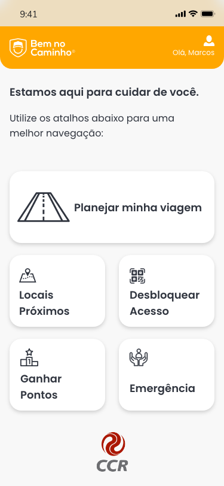

# Equipe 317: B.E.M - Boleia em Movimento

Repositório com o intuito de apresentar o aplicativo Bem no Caminho, proposto no Hackthon da CCR 2020. O objetivo principal desse aplicativo é auxiliar os motoristas, reunindo em uma única aplicação, diversas funcionalidades, como:
<ul>
  <li>Rotas de viagem</li>
  <li>Cuidar da saúde</li>
  <li>Sugestões de paradas</li>
  <li>Botão de emergência</li>
  <li>Gamificação</li>
 </ul>
Também temos como próposito, melhorar a qualidade de vida desses profissionais, onde a interação com o aplicativo libera o acesso ao nosso PPD (Ponto Para Descanso), apelidado carinhosamente de QUADRADÃO.
 
E para auxiliar esse aplicativo na parte de reconhecimento dos exercícios, utilizaremos a biblioteca OpenCV para capturar os movimentos do usuário através da webcam, e verificar se a posição do usuário está correta para o exercício apresentado no aplicativo. Segue abaixo o link contendo o repositório dessa funcionalidade: <a href='https://github.com/andreviniciusmb/Reconhecimento_com_OpenCV'> Reconhecimento com OpenCV</a>.

## O Aplicativo - Bem no Caminho

 

Link para baixar e testar o APK: https://drive.google.com/file/d/1pa9HvZBjh4t1v7Z4uTUp0s7WBxT8Tdxo/view?usp=sharing

Esta é a Home do aplicativo.
 

 
Na parte superior temos um atalho de acesso ao perfil.
Ao centro, focados no perfil de usuário, criamos botões grandes e claros, para fácil acesso a todas as funções do aplicativo. 

Perfil do usuário
 

 

Planejamento da viagem
 

 

Detalhes do QUADRADÃO
 

 

Ganhar pontos
 

 

Exercícios
 

 

Emergência
 

 

Matando a saudade
 

 

Aqui temos o <a href='https://xd.adobe.com/view/04a485da-df19-45f5-55e3-2395bbd7fccc-7295/grid'>link</a> do real protótipo do aplicativo.

## Sobre o Projeto

Desenvolvido para apresentar no Hackathon da CCR 2020.
 
Equipe B.E.M. - Boleia em Movimento:
<ul>
  <li><a href='https://www.linkedin.com/in/andre-vinicius-mendes-barros-800410195/'> André Vinícius</a></li>
  <li><a href='https://www.linkedin.com/in/cristiane-f-silva-florin-ba516a34/'> Cristiane Florin</a></li>
  <li><a href='https://www.linkedin.com/in/dieimerson-vieira/'> Dieimerson Vieira</a></li>
  <li><a href='https://www.linkedin.com/in/f%C3%A1bio-s-cardoso/'> Fábio Cardoso</a></li>
  <li><a href='https://www.linkedin.com/in/igorjuniomelo/'> Igor Junio</a></li>
</ul>
